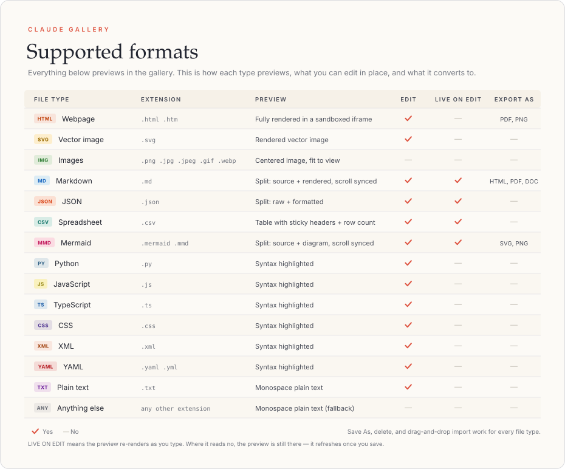

# Claude Gallery

A tiny local app that gives Claude Code in Kiro a live artifact viewer — so when Claude generates HTML, SVGs, charts, code, or data files, they appear in a browser gallery instantly.

## Supported Formats

## Install

### Windows
Download `ClaudeGallery-Setup.exe` from [Releases](https://github.com/HyperBioGhost/claude-gallery/releases/latest) and run it. Next → Next → Finish.

### Mac
Download `ClaudeGallery.pkg` from [Releases](https://github.com/HyperBioGhost/claude-gallery/releases/latest).

macOS will block the installer because it's not signed by Apple. To bypass:

**Option A** — Right-click (or Control + click) the `.pkg` file and choose "Open". The dialog will now have an "Open" button. Click it.

**Option B** — If Option A doesn't show an install option, go to **System Settings → Privacy & Security**, scroll down — you'll see "ClaudeGallery was blocked" with an "Open Anyway" button.

**Option C** (Terminal) — Type `sudo xattr -r -d com.apple.quarantine `, drag the `.pkg` into Terminal, press Enter. Then double-click to install.

## That's it

After installation:
- Claude Gallery runs silently in the background (auto-starts with your computer)
- Open the gallery anytime at **http://localhost:7477**
- Every time Claude generates something viewable, it appears there automatically

## How it works

- A small local server (~15MB RAM, 0% CPU when idle) runs on port 7477
- Claude Code is configured globally to send all generated artifacts to the gallery
- The browser uses a push connection (SSE) — no polling, no background activity

## Uninstall

Windows: Add/Remove Programs → Claude Gallery  
Mac: Run `sudo pkgutil --forget com.claude-gallery.server` and delete `/usr/local/bin/claude-gallery-server`

Both uninstallers cleanly remove the Claude Code configuration they added.
